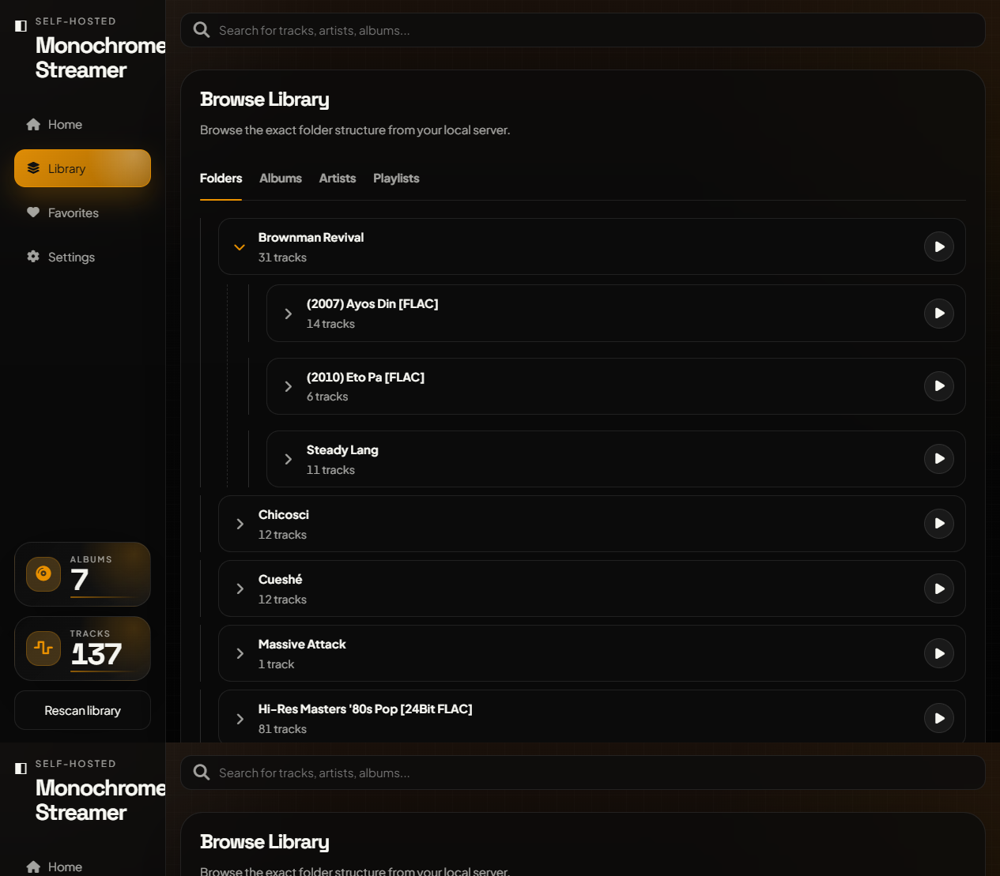
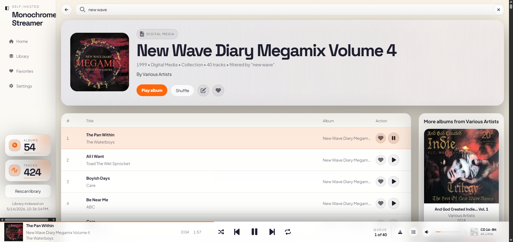

# Monochrome-Streamer

A small self-hosted music streamer inspired by the look and feel of [Monochrome](https://github.com/monochrome-music/monochrome), but built for your own files on your own server.

## What this version does

- Streams music files from your server
- Scans a local folder on your server for audio files
- Reads embedded tags for track title, album, artist, track number, duration, and embedded cover art
- Detects album art from sidecar images like `cover.jpg`, `folder.jpg`, or `front.png`
- Saves synced lyrics as `.lrc` files beside your music files
- Searches MusicBrainz and Cover Art Archive for album metadata, track lists, and cover art
- Lets you add or edit artist images and artist info from the artist page
- Groups music by folder structure:
  - `Artist/Album/01 - Track.mp3`
  - `Artist/Album/1-01 - Track.flac`
- Provides Multiple web UI Theme for browsing albums, artists, favorites, playlists, and folders

## Screenshots

### Floating Player



### Edge-to-Edge Player



## Recommended library layout

This app works best when your library looks like this:

```text
D:\Music
  Artist Name
    Album Name
      cover.jpg
      01 - First Song.flac
      02 - Second Song.flac
```

It will still scan nested folders recursively, but the `Artist/Album/Track` layout gives the cleanest metadata.

## Setup

1. Copy `config.example.json` to `config.json`
2. Edit `config.json` and set `libraryPath` to your music folder
3. Install dependencies:

```powershell
npm install
```

4. Start the server:

```powershell
node server.mjs
```

If online metadata search fails on Windows with a certificate error, start Node with the system certificate store:

```powershell
$env:NODE_OPTIONS="--use-system-ca"
node server.mjs
```

5. Open:

```text
http://localhost:8888
```

## Docker

You can run it in Docker without creating `config.json`.

### Recommended: docker compose

For a quick test with the included sample library:

```powershell
docker compose up --build
```

Then open:

```text
http://localhost:8888
```

For your real music folder, copy the example env file:

```powershell
Copy-Item .env.example .env
```

Then edit `.env`:

```text
MUSIC_DIR=/path/to/your/music
APP_DATA_DIR=/monochrome-streamer/data
APP_TITLE=Monochrome-Streamer
```

`APP_DATA_DIR` is the local server folder where album edits, artist edits, and saved `.lrc` lyrics are stored. Inside Docker it is mounted as `/data`.

Start it in the background:

```powershell
docker compose up -d --build
```

Stop it:

```powershell
docker compose down
```

### Docker run

```powershell
docker build -t monochrome-streamer .
```

```powershell
docker run --rm -p 8888:8888 `
  -e APP_TITLE="Monochrome-Streamer" `
  --mount type=bind,source="/path/to/your/Music",target=/music,readonly `
  --mount type=bind,source="/opt/monochrome-streamer/data",target=/data `
  monochrome-streamer
```

### Dockge

Dockge should usually use an image-only Compose file, not `build: .`, unless the full project folder exists inside the Dockge stack directory.

Use [docker-compose.dockge.yml](docker-compose.dockge.yml) as the starting point:

```yaml
services:
  monochrome-streamer:
    image: judeah666/monochrome-streamer:latest
    container_name: monochrome-streamer
    restart: unless-stopped
    ports:
      - "8888:8888"
    environment:
      APP_TITLE: Monochrome-Streamer
      DATA_DIR: /data
      SCAN_METADATA: tags
      SCAN_DURATIONS: "false"
    volumes:
      - /path/to/your/music:/music:ro
      - /opt/monochrome-streamer/data:/data
```

Change `/path/to/your/music` to the real music folder on the server running Dockge. If Dockge is running on Linux, do not use Windows paths like `D:\Music`; use Linux paths like `/mnt/music`, `/media/music`, or `/home/yourname/Music`.

If the container exits with code `137`, the server is probably killing the scan for memory. Try this safer scanner mode first:

```yaml
environment:
  APP_TITLE: Monochrome-Streamer
  DATA_DIR: /data
  SCAN_METADATA: filename
  SCAN_DURATIONS: "false"
  AUTO_SCAN_ON_START: "false"
```

`SCAN_METADATA=filename` skips audio tag parsing and builds the library from folder/file names only. After the site is stable, switch it back to `tags`.

On first Docker/Dockge launch, the app does not scan every folder automatically. Open Settings > System > Library Folders, select one or more top-level folders from `/music`, then click `Save & Scan`. Start with one folder, confirm the app stays stable, then add more folders and scan again.

Scans are incremental after the first run. The app writes `/data/library-cache.json` and reuses unchanged files by size and modified time, so future scans only parse new or changed files.

After deploy, Dockge should show the container as healthy. If it is running but the site does not open, test the API directly from the server:

```bash
curl http://127.0.0.1:8888/api/config
```

## Configuration

`config.json`

```json
{
  "title": "Monochrome-Streamer",
  "libraryPath": "/path/to/your/music",
  "dataDir": "",
  "artistInfoPath": "artist-info.json",
  "artistOverridesPath": "artist-overrides.json",
  "albumOverridesPath": "album-overrides.json",
  "host": "0.0.0.0",
  "port": 8888
}
```

You can also override values with environment variables:

- `MUSIC_LIBRARY_PATH`
- `APP_TITLE`
- `DATA_DIR`
- `APP_DATA_DIR` for Docker Compose host storage
- `SCAN_METADATA` as `tags` or `filename`
- `SCAN_DURATIONS` as `true` or `false`
- `AUTO_SCAN_ON_START` as `true` or `false`
- `ARTIST_INFO_PATH`
- `ARTIST_OVERRIDES_PATH`
- `ALBUM_OVERRIDES_PATH`
- `HOST`
- `PORT`

### Manual artist info

Artist pages try `artist-info.json` first. Copy `artist-info.example.json` to `artist-info.json`, then add entries like this:

```json
{
  "artists": {
    "Brownman Revival": {
      "imageUrl": "https://example.com/artist-image.jpg",
      "bio": "Short bio to show on the artist page.",
      "sourceUrl": "https://example.com/artist-info",
      "source": "manual"
    }
  }
}
```

If an artist is not in that file, the server tries to fetch a Wikipedia image and summary. If the server has no internet access or nothing is found, the UI falls back to initials.

Artist edits made inside the app are saved separately in `artist-overrides.json`, or in Docker at `/data/artist-overrides.json` by default. With Docker Compose, that file appears on the host inside `APP_DATA_DIR`. Edited artist info takes priority over `artist-info.json`.

### Album tag editor

Use the edit icon on the full album page to open the tag editor. You can edit album title, album artist, year, genre, multiple media types, collection status, cover URL, track titles, track artists, and track numbers.

The editor saves local overrides in `album-overrides.json`, or in Docker at `/data/album-overrides.json` by default. With Docker Compose, that file appears on the host inside `APP_DATA_DIR`. It does not rewrite your original audio files.

The online search uses MusicBrainz for release metadata and Cover Art Archive for cover art.

## API

- `GET /api/config`
- `GET /api/library`
- `POST /api/rescan`
- `GET /api/library/folders`
- `POST /api/library/folders`
- `GET /api/artists/:name/info`
- `POST /api/artists/:name/info`
- `POST /api/albums/:id/cover`
- `POST /api/albums/:id/tags`
- `GET /api/albums/:id/tag-suggestions`
- `GET /api/musicbrainz/releases/:id`
- `GET /api/tracks/:id/stream`
- `GET /api/tracks/:id/cover`

## Notes

- This is not a full fork of upstream Monochrome. The upstream app is much broader and built around online APIs and remote catalog data.
- This version keeps the local-server use case simple and focused so you can own the whole stack.
- In Docker, environment variables are the easiest way to configure the app, especially `MUSIC_LIBRARY_PATH=/music` with a bind mount.
