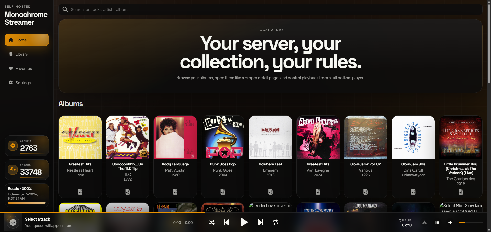
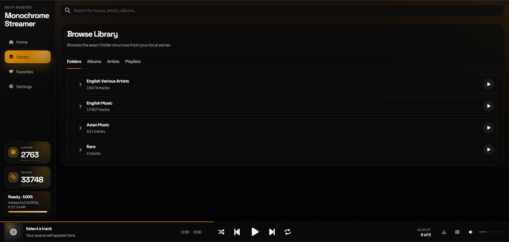
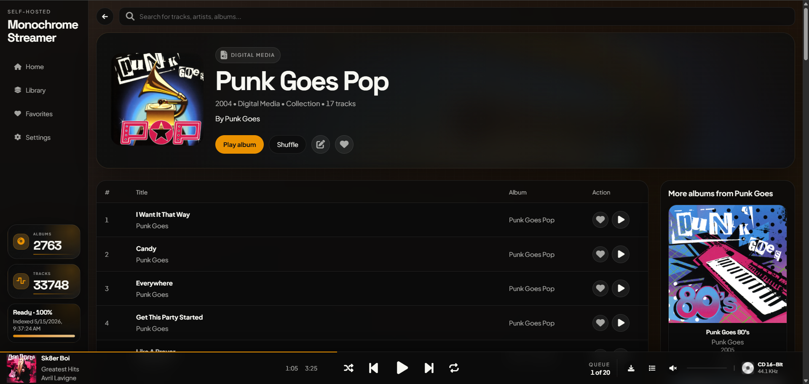
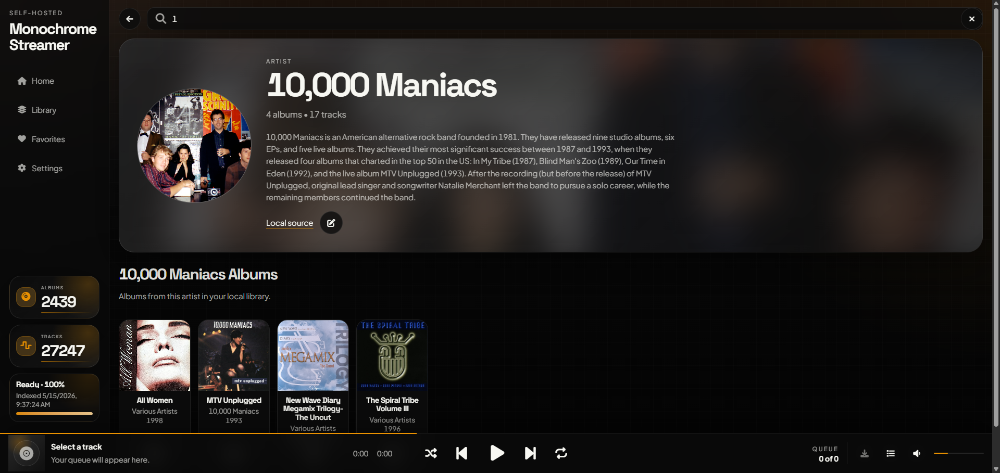
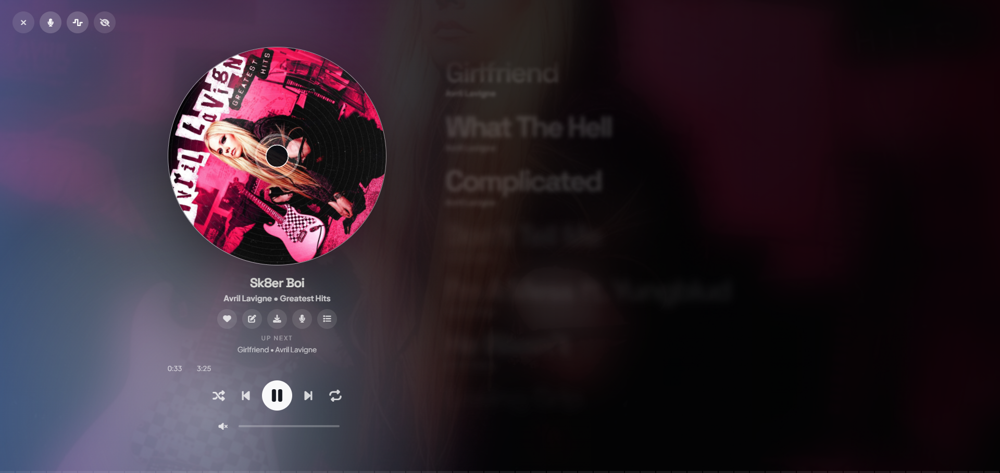

# monochrome-streamer

Current release: `v0.2.1`

`monochrome-streamer` is a self-hosted music streamer for your own local music files. It is inspired by [Monochrome](https://github.com/monochrome-music/monochrome), but the library, album edits, lyrics, covers, users, and scan data live on your own server.

## Features

- Stream local music from a mounted server folder.
- Browse albums, artists, tracks, collections, wishlist albums, and favorites.
- Scan selected top-level folders instead of forcing a full-library scan on startup.
- Store the library index, album overrides, artist overrides, lyrics, users, and cached covers in SQLite/data storage.
- Edit album tags locally without rewriting the original audio files.
- Save synced lyrics as `.lrc` sidecar files beside music files when possible.
- Search MusicBrainz and Cover Art Archive for album metadata and covers.
- Use two player layouts: Floating Player and Edge-to-Edge.
- Manage users, download permissions, widget API keys, download settings, and scans from the Admin sidebar tab.

## Screenshots












## Recommended Library Layout

The app scans recursively, but clean folder/tag organization gives the best result:

```text
Music/
  Artist Name/
    Album Name/
      cover.jpg
      01 - First Song.flac
      02 - Second Song.flac
```

For multi-disc or collection albums, nested folders are supported:

```text
Music/
  Various Artists/
    80s Collection/
      Vol 1/
      Vol 2/
```

## Docker Quick Start

Copy the example environment file:

```powershell
Copy-Item .env.example .env
```

Edit `.env`:

```env
MUSIC_DIR=D:\Music
APP_DATA_DIR=D:\Monochrome-Streamer\data
APP_TITLE=Monochrome-Streamer
ADMIN_USERNAME=admin
ADMIN_PASSWORD=change-this-admin-password
NOAUTH=false
DOWNLOADS=true
PUID=1000
PGID=1000
UMASK=022
CHOWN_DATA=true
WIDGET_API_KEY=change-this-widget-key
WIDGET_CORS_ORIGIN=*
```

Start the app:

```powershell
docker compose up -d
```

Open:

```text
http://localhost:8888
```

Sign in with the admin account from `.env`, open the `Admin` sidebar tab, then select folders in `System` and click `Save & Scan`.

## Dockge / Server Compose

Use this shape for Dockge or a Linux server:

```yaml
services:
  monochrome-streamer:
    image: judeah666/monochrome-streamer:latest
    container_name: monochrome-streamer
    restart: unless-stopped
    ports:
      - "8888:8888"
    env_file:
      - .env
    volumes:
      - /path/to/your/music:/music
      - /opt/monochrome-streamer/data:/data
```

On Linux, use Linux paths like `/mnt/music`, `/media/music`, or `/home/user/Music`. Do not use Windows paths like `D:\Music` inside Dockge unless Dockge itself is running on Windows.

The Docker image already defaults to:

```env
MUSIC_LIBRARY_PATH=/music
DATA_DIR=/data
SCAN_METADATA=tags
SCAN_DURATIONS=false
AUTO_SCAN_ON_START=false
PORT=8888
```

## Data Folder

`APP_DATA_DIR` on the host is mounted as `/data` inside Docker.

This folder stores:

- `library.sqlite`
- cached cover art
- user accounts
- widget settings
- app edits and overrides
- saved lyrics data

Keep this folder when updating Docker images. If it is deleted, the app will need to rebuild the library index.

## Login And Admin

The first admin account comes from `.env`:

```env
ADMIN_USERNAME=admin
ADMIN_PASSWORD=change-this-admin-password
```

Change the password before exposing the app on your network. The Docker entrypoint refuses unsafe default passwords.

Optional anonymous mode:

```env
NOAUTH=true
DOWNLOADS=true
```

When `NOAUTH=true`, the main app opens without a login wall. Guests can still visit `/login` manually if you want to sign in as admin or as a managed user. `DOWNLOADS` only affects guest access in this mode.

Admin users can:

- add or update users
- enable or disable downloads per user
- manage download behavior
- manage widget API keys
- choose scan folders
- start manual scans
- view scan status

Regular users only see the main app.

## Scanning

The app does not auto-scan the whole mounted music folder by default. This avoids memory spikes on large libraries.

Recommended first scan:

1. Sign in as admin.
2. Open `Admin`.
3. Go to `System`.
4. Click `Refresh Folders`.
5. Select one or more top-level folders.
6. Click `Save & Scan`.

Scans are incremental after the first successful scan. Unchanged files are reused from `library.sqlite` by size and modified time.

If your server runs out of memory, use the safer scan mode:

```env
SCAN_METADATA=filename
SCAN_DURATIONS=false
AUTO_SCAN_ON_START=false
```

Then scan smaller folder groups from the Admin panel.

## Environment Variables

Common variables:

| Variable | Purpose |
| --- | --- |
| `MUSIC_DIR` | Host path mounted to `/music` by compose |
| `APP_DATA_DIR` | Host path mounted to `/data` by compose |
| `APP_TITLE` | Browser/app/sidebar title |
| `ADMIN_USERNAME` | First admin username |
| `ADMIN_PASSWORD` | First admin password |
| `NOAUTH` | `true` lets guests open the app without the login wall |
| `DOWNLOADS` | Guest download access when `NOAUTH=true` |
| `PUID` / `PGID` | Linux owner for Docker-created files |
| `UMASK` | File permission mask |
| `CHOWN_DATA` | Fix `/data` ownership on startup |
| `WIDGET_API_KEY` | API key for external stats widgets |
| `WIDGET_CORS_ORIGIN` | Allowed browser origin for widget API |

Advanced variables:

| Variable | Default |
| --- | --- |
| `HOST` | `0.0.0.0` |
| `PORT` | `8888` |
| `MUSIC_LIBRARY_PATH` | `/music` |
| `DATA_DIR` | `/data` |
| `LIBRARY_DATABASE_PATH` | `/data/library.sqlite` |
| `COVER_CACHE_PATH` | `/data/covers` |
| `SCAN_METADATA` | `tags` |
| `SCAN_DURATIONS` | `false` |
| `AUTO_SCAN_ON_START` | `false` |
| `REQUIRE_ADMIN_CREDENTIALS` | `true` in Docker entrypoint |

## Local Development

Install dependencies:

```powershell
npm install
```

Build:

```powershell
npm run build
```

Start:

```powershell
npm start
```

Open:

```text
http://localhost:8888
```

Useful scripts:

```powershell
npm run dev
npm run dev:frontend
npm run dev:tailwind
npm test
npm run verify
```

The frontend uses React, Vite, and Tailwind with a `tw-` prefix. Preflight is disabled so Tailwind can coexist with the existing app styling.

## Docker Hub Upload

Log in:

```powershell
docker login
```

Build and push both the release tag and `latest`:

```powershell
docker buildx build --platform linux/amd64 `
  -t judeah666/monochrome-streamer:0.2.1 `
  -t judeah666/monochrome-streamer:latest `
  --push .
```

## Widget Stats API

Use this endpoint for dashboards that only need album count, track count, and scan status:

```text
GET /api/widget/stats
```

Header auth:

```bash
curl -H "x-api-key: change-this-widget-key" http://127.0.0.1:8888/api/widget/stats
```

Query auth:

```bash
curl "http://127.0.0.1:8888/api/widget/stats?apiKey=change-this-widget-key"
```

Example response:

```json
{
  "title": "Monochrome-Streamer",
  "albumCount": 1444,
  "trackCount": 16285,
  "generatedAt": "2026-05-20T10:18:30.000Z",
  "scan": {
    "status": "ready",
    "percent": 100,
    "processedFiles": 16285,
    "totalFiles": 16285,
    "error": null
  }
}
```

## Notes

- Album edits, artist edits, lyrics, and user data are stored locally and survive Docker image updates when `/data` is preserved.
- The album editor does not rewrite your audio files.
- Lyrics can also be written as `.lrc` files beside tracks when the music folder is writable.
- This is not a full fork of upstream Monochrome. It is a local-server streamer built around your own files.
