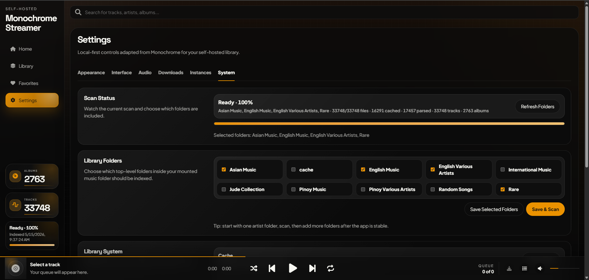

# monochrome-streamer

Current release: `v0.2.1`

A small self-hosted music streamer inspired by the look and feel of [Monochrome](https://github.com/monochrome-music/monochrome), but built for your own files on your own server.

## What this version does

- Streams music files from your server
- Scans a local folder on your server for audio files
- Reads embedded tags for track title, album, artist, track number, duration, and embedded cover art
- Detects album art from sidecar images like `cover.jpg`, `folder.jpg`, or `front.png`
- Saves synced lyrics as `.lrc` files beside your music files
- Searches MusicBrainz and Cover Art Archive for album metadata, track lists, and cover art
- Lets you add or edit artist images and artist info from the artist page
- Groups music by folder structure:
  - `Artist/Album/01 - Track.mp3`
  - `Artist/Album/1-01 - Track.flac`
- Provides Multiple web UI Theme for browsing albums, artists, favorites, playlists, collections, and folders
- Includes login, per-user download permissions, and an Admin sidebar tab for server controls

## Recent changes in v0.2.1

- Moved server-only controls into an in-app Admin sidebar view for admin users.
- Improved login/sidebar account controls with a same-row logout action.
- Fixed library pager controls so per-page changes work from React-rendered library views.
- Added collection browsing, wishlist album entry, theme palette improvements, and refined admin/user settings.

## Screenshots

### Home Screen


### Library


### Album


### Artist


### Fullscreen Now Playing


### Add your Folder in settings



### Floating Player


### Edge-to-Edge Player


## Recommended library layout

This app works best when your library looks like this:

```text
D:\Music
  Artist Name
    Album Name
      cover.jpg
      01 - First Song.flac
      02 - Second Song.flac
```

It will still scan nested folders recursively, but the `Artist/Album/Track` layout gives the cleanest metadata.

## Setup

1. Copy `config.example.json` to `config.json`
2. Edit `config.json` and set `libraryPath` to your music folder
3. Install dependencies:

```powershell
npm install
```

4. Build the React frontend bundle:

```powershell
npm run build
```

5. Start the server:

```powershell
npm start
```

If online metadata search fails on Windows with a certificate error, start Node with the system certificate store:

```powershell
$env:NODE_OPTIONS="--use-system-ca"
node server.mjs
```

6. Open:

```text
http://localhost:8888
```

## Docker

You can run it in Docker without creating `config.json`.

Docker builds the React frontend automatically before the server starts.

### Recommended: docker compose

For a quick test with the included sample library:

```powershell
docker compose up --build
```

Then open:

```text
http://localhost:8888
```

For your real music folder, copy the example env file:

```powershell
Copy-Item .env.example .env
```

Then edit `.env`:

```text
MUSIC_DIR=/path/to/your/music
APP_DATA_DIR=/monochrome-streamer/data
APP_TITLE=Monochrome-Streamer
ADMIN_USERNAME=admin
ADMIN_PASSWORD=change-this-admin-password
PUID=1000
PGID=1000
UMASK=022
CHOWN_DATA=true
WIDGET_API_KEY=change-this-widget-key
IMAGE_TAG=0.2.1
```

`APP_DATA_DIR` is the local server folder where album edits, artist edits, saved `.lrc` lyrics, the SQLite library index, and cached cover art are stored. Inside Docker it is mounted as `/data`.

Start it in the background:

```powershell
docker compose up -d --build
```

Stop it:

```powershell
docker compose down
```

### Docker run

```powershell
docker build -t monochrome-streamer .
```

```powershell
docker run --rm -p 8888:8888 `
  -e APP_TITLE="Monochrome-Streamer" `
  -e ADMIN_USERNAME=admin `
  -e ADMIN_PASSWORD="use-a-real-password-here" `
  -e PUID=1000 `
  -e PGID=1000 `
  -e UMASK=022 `
  --mount type=bind,source="/path/to/your/Music",target=/music `
  --mount type=bind,source="/opt/monochrome-streamer/data",target=/data `
  monochrome-streamer
```

### Upload to Docker Hub

Log in first:

```powershell
docker login
```

Build and push the release tag:

```powershell
docker buildx build --platform linux/amd64 -t judeah666/monochrome-streamer:0.2.1 --push .
```

Also update `latest` if this is the version you want Dockge to pull by default:

```powershell
docker buildx build --platform linux/amd64 -t judeah666/monochrome-streamer:latest --push .
```

Or push both tags in one build:

```powershell
docker buildx build --platform linux/amd64 -t judeah666/monochrome-streamer:0.2.1 -t judeah666/monochrome-streamer:latest --push .
```

### Dockge

Dockge should usually use an image-only Compose file, not `build: .`, unless the full project folder exists inside the Dockge stack directory.

Use [docker-compose.dockge.yml](docker-compose.dockge.yml) as the starting point:

```yaml
services:
  monochrome-streamer:
    image: judeah666/monochrome-streamer:0.2.1
    container_name: monochrome-streamer
    restart: unless-stopped
    ports:
      - "8888:8888"
    env_file:
      - .env
    volumes:
      - /path/to/your/music:/music
      - /opt/monochrome-streamer/data:/data
```

Change `/path/to/your/music` to the real music folder on the server running Dockge. If Dockge is running on Linux, do not use Windows paths like `D:\Music`; use Linux paths like `/mnt/music`, `/media/music`, or `/home/yourname/Music`.

The image already defaults to:

- `MUSIC_LIBRARY_PATH=/music`
- `DATA_DIR=/data`
- `SCAN_METADATA=tags`
- `SCAN_DURATIONS=false`
- `AUTO_SCAN_ON_START=false`
- `PUID=1000`, `PGID=1000`, `UMASK=022`, `CHOWN_DATA=true`

You only need to add those values to `.env` if you want to override the defaults.

Set `PUID` and `PGID` to the Linux user and group that should own files created in `/data`. On many home servers this is `1000:1000`, but you can check with:

```bash
id yourusername
```

`CHOWN_DATA=true` fixes `/data` ownership on container start. After the data folder is already owned correctly, you can set it to `false` to make startup faster on very large cache folders.

If the container exits with code `137`, the server is probably killing the scan for memory. Try this safer scanner mode first:

```env
SCAN_METADATA=filename
SCAN_DURATIONS=false
AUTO_SCAN_ON_START=false
```

`SCAN_METADATA=filename` skips audio tag parsing and builds the library from folder/file names only. After the site is stable, switch it back to `tags`.

On first Docker/Dockge launch, the app does not scan every folder automatically. Sign in with the admin account, open the Admin sidebar tab, then use System > Library Folders to select one or more top-level folders from `/music` and click `Save & Scan`. Start with one folder, confirm the app stays stable, then add more folders and scan again.

Scans are incremental after the first run. The app stores the library index in `/data/library.sqlite` and reuses unchanged files by size and modified time, so future scans only parse new or changed files.

After deploy, Dockge should show the container as healthy. Open `http://SERVER-IP:8888`, sign in, then use the Admin sidebar tab for server-only controls.

### Login and Admin

The web app now requires a login. Put the first admin account in the `.env` file beside your compose file:

```env
ADMIN_USERNAME=admin
ADMIN_PASSWORD=change-this-admin-password
```

Change `ADMIN_PASSWORD` before exposing the server on your network. Docker refuses to start when `ADMIN_PASSWORD` is missing, still set to `admin`, or still set to `change-this-admin-password`.

User accounts created in the Admin sidebar tab are saved in `/data/users.json`, so they survive container rebuilds and image updates.

Do not hardcode `ADMIN_USERNAME` or `ADMIN_PASSWORD` directly inside `compose.yaml`. The included compose files load `.env` with `env_file`, and the Docker entrypoint checks that those credentials are present before the app starts.

Use the Admin sidebar tab for:

- adding and removing users
- enabling or disabling downloads per user
- download format and ZIP download settings
- widget/API key settings
- selected library folders and manual scans

## Configuration

## Frontend Development

The app uses a Vite + React frontend pipeline with Tailwind available for gradual UI work.

```powershell
npm run build
```

The production bundle is written to `public/react/app.js`, which is loaded by `public/index.html`. The backend API remains in `server.mjs`.

The current frontend is a stable hybrid:

- `src/react/` contains the React shell and UI sections.
- `src/controller/` owns routing, playback, scanning, data loading, persistence actions, and tested view-model presenters.
- React UI sections receive stable snapshots for queue, player, settings, album/detail views, library views, and editors.
- Tailwind classes use the `tw-` prefix and Preflight is disabled so Tailwind can coexist with the existing CSS.

For frontend-only iteration, you can also run:

```powershell
npm run dev:frontend
```

Tailwind is scaffolded for gradual React migration. It uses a `tw-` prefix and disables Preflight so it can coexist with the current CSS. When adding Tailwind classes during development, run this in a second terminal:

```powershell
npm run dev:tailwind
```

See [docs/tailwind-migration.md](docs/tailwind-migration.md) for the migration rules.

Run the test suite after controller, presenter, player, queue, settings, or library changes:

```powershell
npm test
```

For Docker parity, verify with:

```powershell
docker run --rm -v "${PWD}:/app" -w /app node:24-alpine sh -lc "npm run build"
```

`config.json`

```json
{
  "title": "Monochrome-Streamer",
  "libraryPath": "/path/to/your/music",
  "dataDir": "",
  "artistInfoPath": "artist-info.json",
  "lyricsSidecarPath": "lyrics",
  "libraryFoldersPath": "library-folders.json",
  "libraryDatabasePath": "library.sqlite",
  "coverCachePath": "covers",
  "widgetSettingsPath": "widget-settings.json",
  "widgetApiKey": "change-this-widget-key",
  "widgetCorsOrigin": "*",
  "host": "0.0.0.0",
  "port": 8888
}
```

You can also override values with environment variables:

- `MUSIC_LIBRARY_PATH`
- `APP_TITLE`
- `DATA_DIR`
- `APP_DATA_DIR` for Docker Compose host storage
- `LIBRARY_DATABASE_PATH` defaults to `/data/library.sqlite` in Docker
- `COVER_CACHE_PATH` defaults to `/data/covers` in Docker
- `SCAN_METADATA` as `tags` or `filename`
- `SCAN_DURATIONS` as `true` or `false`
- `AUTO_SCAN_ON_START` as `true` or `false`
- `REQUIRE_ADMIN_CREDENTIALS` as `true` or `false`, defaults to `true` in the Docker entrypoint
- `WIDGET_API_KEY` for the external stats widget API
- `WIDGET_CORS_ORIGIN` for widget browser access, defaults to `*`
- `WIDGET_SETTINGS_PATH` for widget API settings saved from the app, defaults to `/data/widget-settings.json` in Docker
- `PUID` and `PGID` for Docker file ownership, defaults to `1000`
- `UMASK` for Docker-created file permissions, defaults to `022`
- `CHOWN_DATA` as `true` or `false`, defaults to `true`
- `ARTIST_INFO_PATH`
- `HOST`
- `PORT`

### Manual artist info

Artist pages try `artist-info.json` first. Copy `artist-info.example.json` to `artist-info.json`, then add entries like this:

```json
{
  "artists": {
    "Brownman Revival": {
      "imageUrl": "https://example.com/artist-image.jpg",
      "bio": "Short bio to show on the artist page.",
      "sourceUrl": "https://example.com/artist-info",
      "source": "manual"
    }
  }
}
```

If an artist is not in that file, the server tries to fetch a Wikipedia image and summary. If the server has no internet access or nothing is found, the UI falls back to initials.

Artist edits made inside the app are saved in `library.sqlite`. Edited artist info takes priority over `artist-info.json`. Existing legacy `artist-overrides.json` files are imported into SQLite automatically if the database does not already contain artist overrides.

### Album tag editor

Use the edit icon on the full album page to open the tag editor. You can edit album title, album artist, year, genre, multiple media types, collection status, cover URL, track titles, track artists, and track numbers.

The editor saves local overrides in `library.sqlite`. Existing legacy `album-overrides.json` files are imported into SQLite automatically if the database does not already contain album overrides. It does not rewrite your original audio files.

The online search uses MusicBrainz for release metadata and Cover Art Archive for cover art.

### Lyrics storage

Lyrics saved in the app are stored in `library.sqlite` and also written as `.lrc` files beside the matching music files when possible. Existing legacy `lyrics-overrides.json` files are imported into SQLite automatically if the database does not already contain lyrics overrides.

## API

- `GET /api/config`
- `GET /api/widget/stats`
- `GET /api/library`
- `POST /api/rescan`
- `GET /api/library/folders`
- `POST /api/library/folders`
- `GET /api/artists/:name/info`
- `POST /api/artists/:name/info`
- `POST /api/albums/:id/cover`
- `POST /api/albums/:id/tags`
- `GET /api/albums/:id/tag-suggestions`
- `GET /api/musicbrainz/releases/:id`
- `GET /api/tracks/:id/stream`
- `GET /api/tracks/:id/cover`

### External widget stats API

Use `GET /api/widget/stats` when another app only needs the current album and track counts. This endpoint is protected by `WIDGET_API_KEY` and does not return the full library.

You can also create, rotate, copy, and test the widget API key from Admin > Instances. Changes made there are saved in `/data/widget-settings.json` in Docker, so they survive image updates.

Header auth:

```bash
curl -H "x-api-key: change-this-widget-key" http://127.0.0.1:8888/api/widget/stats
```

Query auth, useful for simple dashboard widgets:

```bash
curl "http://127.0.0.1:8888/api/widget/stats?apiKey=change-this-widget-key"
```

Example response:

```json
{
  "title": "Monochrome-Streamer",
  "albumCount": 1444,
  "trackCount": 16285,
  "generatedAt": "2026-05-20T10:18:30.000Z",
  "scan": {
    "status": "ready",
    "percent": 100,
    "currentFolder": "",
    "processedFiles": 16285,
    "totalFiles": 16285,
    "finishedAt": "2026-05-20T10:18:30.000Z",
    "error": null
  }
}
```

## Notes

- This is not a full fork of upstream Monochrome. The upstream app is much broader and built around online APIs and remote catalog data.
- This version keeps the local-server use case simple and focused so you can own the whole stack.
- In Docker, environment variables are the easiest way to configure the app, especially `MUSIC_LIBRARY_PATH=/music` with a bind mount.
