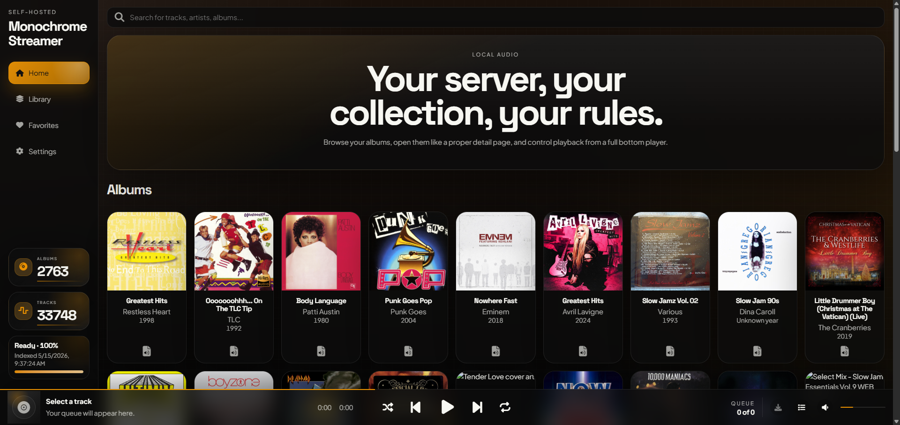
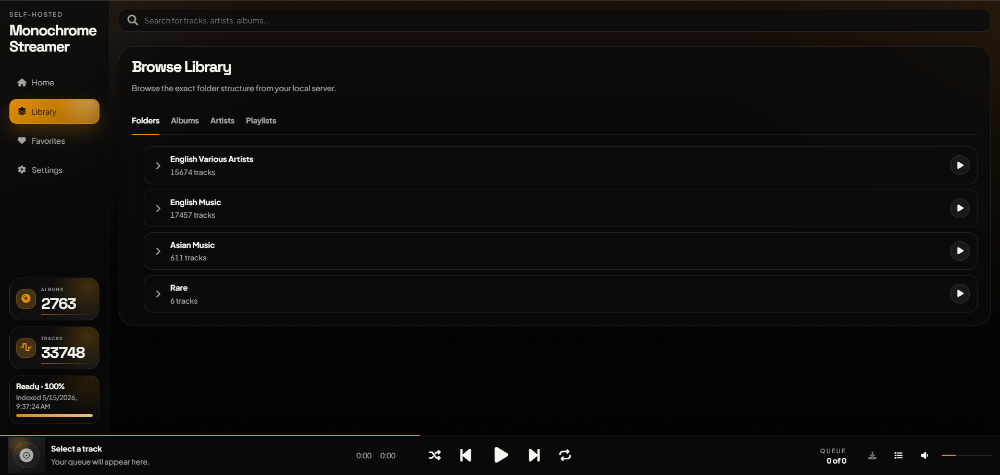
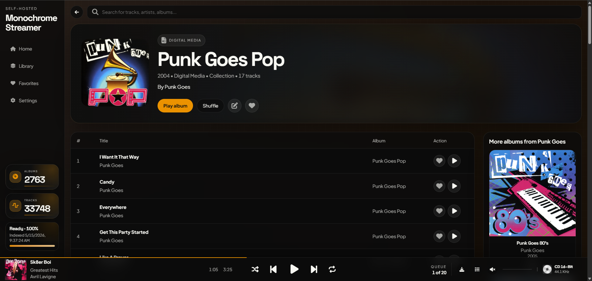
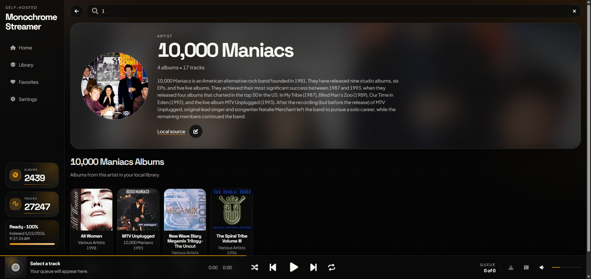
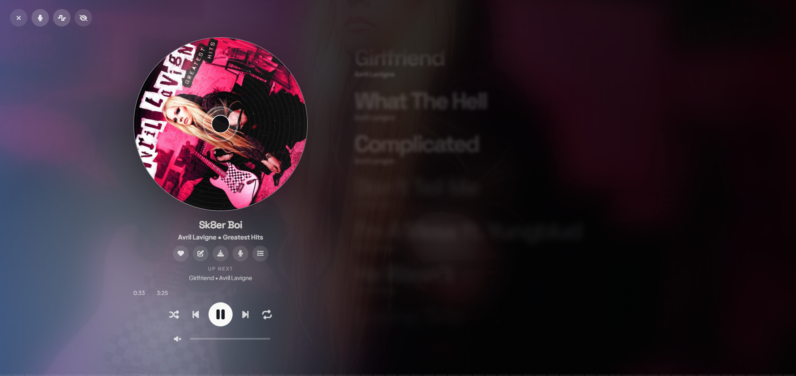
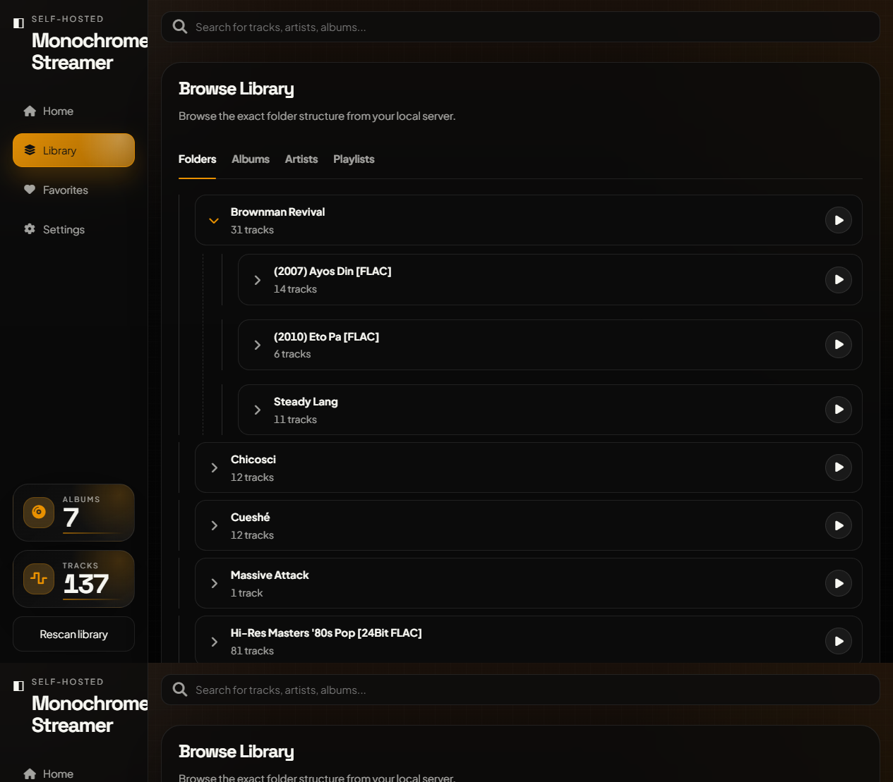
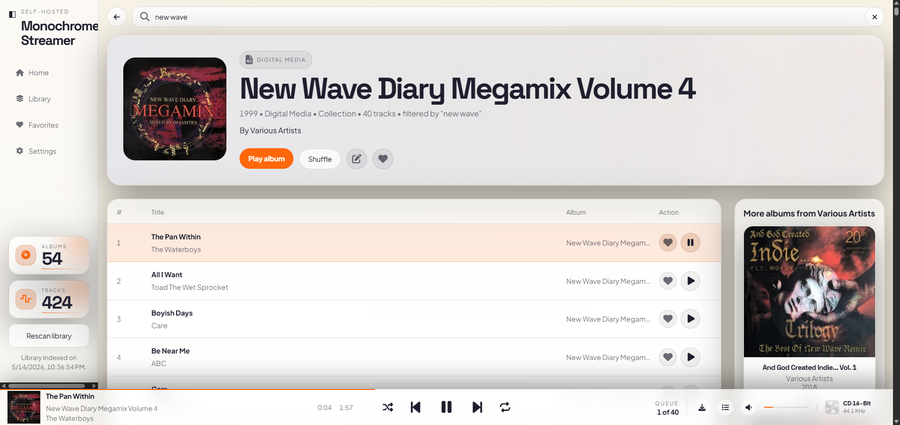

# Monochrome-Streamer

Current release: `v0.3.5`

Monochrome-Streamer is a self-hosted music server and responsive web player for your own audio library. Music stays on your server, while the library index, users, edits, lyrics, playlists, collections, and cached artwork are stored under your app data directory.

Inspired by [Monochrome](https://github.com/monochrome-music/monochrome), this project is built around local files and independent server ownership.

## Highlights

- Browse albums, artists, tracks, collections, playlists, favorites, and wishlist albums.
- Stream original files with byte-range seeking or use cached `CD FLAC` and `MP3 320 kbps` playback profiles.
- Use Floating and Qobuz player layouts, stable shuffle, gapless autoplay, ReplayGain, queue persistence, and fullscreen now playing.
- Scan selected top-level folders incrementally, scan one folder, or force a full metadata refresh.
- Edit album metadata without rewriting source audio files.
- Search MusicBrainz and Cover Art Archive, upload covers, and save synced `.lrc` lyrics.
- Download original files, CD-quality FLAC, or MP3 at 320/256/128 kbps with configurable names, disc folders, permissions, and visible status feedback.
- Manage users, online activity, download history, scans, backups, exports, and widget access from the Admin view.
- Cache optimized WebP artwork and lightweight album-card payloads for large libraries.
- Run with Docker, Dockge, or Node.js on Windows and Linux.

## What Is New In `v0.3.5`

- Simplified, flatter layouts across library, detail, settings, and admin views while preserving glass player and queue surfaces.
- Numbered pagination with hidden single-page controls and preserved page state during navigation.
- Submit-based search that avoids requests while typing and restores search state after opening a result.
- Album quality indicators for Hi-Res, CD-quality, and MP3 libraries.
- ReplayGain track/album modes with configurable pre-amplification.
- Cleaner album, artist, and collection detail views with compact track action menus.
- Improved album sharing, login flow, fullscreen controls, mobile track actions, and Qobuz player consistency.
- Additional bundled font choices managed from Admin settings.

## Screenshots















## Docker Quick Start

1. Copy the environment template.

```powershell
Copy-Item .env.example .env
```

2. Set your host paths and admin credentials in `.env`.

```env
MUSIC_DIR=D:\Music
APP_DATA_DIR=D:\Monochrome-Streamer\data
APP_TITLE=Monochrome-Streamer
ADMIN_USERNAME=admin
ADMIN_PASSWORD=change-this-admin-password
DOWNLOADS=false
PUID=1000
PGID=1000
UMASK=022
CHOWN_DATA=auto
```

3. Start the container.

```powershell
docker compose up -d
```

4. Open `http://localhost:8888`.

Guest browsing is enabled by default, but guest downloads are disabled. Open `/#login` to sign in as an admin or managed user. Both guest options can be changed from Admin access settings.

### Dockge Or Linux Server

```yaml
services:
  monochrome-streamer:
    image: judeah666/monochrome-streamer:latest
    container_name: monochrome-streamer
    restart: unless-stopped
    ports:
      - "8888:8888"
    env_file:
      - .env
    volumes:
      - /path/to/your/music:/music:ro
      - /opt/monochrome-streamer/data:/data
```

Use Linux host paths such as `/mnt/music` or `/home/user/Music`. The music mount may be read-only unless you want the app to write `.lrc` sidecars beside tracks.

## First Run

1. Open `/#login` and sign in as admin.
2. Open `Admin`, then select `System`.
3. Click `Refresh Folders`.
4. Select the top-level music folders to index and click `Save Folders`.
5. Use `Scan Changes` for a normal incremental scan, `Scan Folder` for one selected folder, or `Full Rescan` to reread all selected folders.

Automatic scanning on container startup is disabled by default so large libraries do not delay startup.

## Library Layout

Scanning is recursive, but consistent folders and tags produce the best results.

```text
Music/
  Artist Name/
    Album Name/
      cover.jpg
      01 - First Song.flac
      02 - Second Song.flac
```

Nested disc or volume folders are supported.

```text
Music/
  Various Artists/
    80s Collection/
      CD1/
      CD2/
```

Normal scans reuse unchanged files by size and modification time. Use `Full Rescan` after changing tags with a third-party editor when you need every selected file parsed again.

## Data And Backups

The host `APP_DATA_DIR` is mounted as `/data` and contains the persistent application state, including:

- `library.sqlite` and its SQLite support files
- user accounts and activity history
- library folder selections and local metadata overrides
- playlists, collections, favorites, wishlist state, and lyrics data
- optimized covers and playback transcode caches
- widget and download settings

Preserve `/data` when updating the image.

For a complete backup, stop the container or otherwise pause writes, then copy the entire app data directory to a timestamped location outside the active directory. Restoring that snapshot before restarting the app returns all persistent state together.

The Admin database export is useful for a consistent SQLite snapshot, but it does not replace a full `/data` backup. Excel export is intended for album inventory and supports wishlist, media-type, and folder filters.

## Authentication And Security

The built-in defaults allow guest browsing while keeping downloads private. Sign in as admin and use the Access panel to require login, enable guest browsing, or change guest download permission.

- Guests can browse and play music but cannot download files.
- Downloads require a signed-in non-guest account with download permission.
- Admin and authenticated mutations use per-session CSRF tokens and same-origin validation.
- Login attempts are rate-limited and logout uses a protected POST request.
- Widget access requires a real API key and a specific `http://` or `https://` CORS origin.

To require login before browsing, open Admin access settings and disable Guest access.

For an HTTPS reverse proxy such as Caddy, Traefik, Nginx Proxy Manager, or Cloudflare Tunnel, forward the original host/protocol and set:

```env
TRUST_PROXY=true
REQUIRE_HTTPS_FOR_AUTH=true
```

Only enable `TRUST_PROXY` when requests reach the app through a proxy you control.

## Configuration

Common host and access variables:

| Variable | Default | Purpose |
| --- | --- | --- |
| `MUSIC_DIR` | `./sample-library` | Host music path mounted to `/music` by Compose |
| `APP_DATA_DIR` | `./data` | Host application data path mounted to `/data` |
| `APP_TITLE` | `Monochrome-Streamer` | Browser and application title |
| `ADMIN_USERNAME` | `admin` | Environment admin username |
| `ADMIN_PASSWORD` | unset | Environment admin password |
| `DOWNLOADS` | `false` | Initial anonymous guest-download default; Admin access settings take over after they are saved |
| `PUID` / `PGID` | `1000` | Linux owner for container-created files |
| `UMASK` | `022` | File permission mask |
| `CHOWN_DATA` | `auto` | Check data write access; `true` forces recursive ownership repair |

Server and scan variables:

| Variable | Default | Purpose |
| --- | --- | --- |
| `HOST` | `0.0.0.0` | Bind address |
| `PORT` | `8888` | HTTP port |
| `MUSIC_LIBRARY_PATH` | `/music` | Music path inside Docker |
| `DATA_DIR` | `/data` | Persistent data path inside Docker |
| `SCAN_METADATA` | `tags` | Metadata mode; use `filename` for a lower-memory fallback |
| `SCAN_DURATIONS` | `false` | Probe duration while scanning |
| `AUTO_SCAN_ON_START` | `false` | Start a scan when the server starts |
| `MAX_CONCURRENT_MP3_DOWNLOADS` | `2` | Maximum simultaneous MP3 conversions |
| `API_SLOW_REQUEST_THRESHOLD_MS` | `250` | Log API requests slower than this threshold |

Security and integration variables:

| Variable | Default | Purpose |
| --- | --- | --- |
| `TRUST_PROXY` | `false` | Trust forwarded host and protocol headers |
| `REQUIRE_HTTPS_FOR_AUTH` | `false` | Reject authenticated sessions over insecure requests |
| `WIDGET_API_KEY` | unset | External widget stats API key |
| `WIDGET_CORS_ORIGIN` | unset | Specific browser origin allowed to call the widget API |

See [.env.example](.env.example) and [config.example.json](config.example.json) for templates.

## Widget Stats API

Enable the widget in `Admin > Instances`, then request:

```text
GET /api/widget/stats
```

Use either header or query authentication:

```bash
curl -H "x-api-key: your-widget-key" http://127.0.0.1:8888/api/widget/stats
curl "http://127.0.0.1:8888/api/widget/stats?apiKey=your-widget-key"
```

The response contains the app title, album and track counts, library generation time, and current scan status.

## Local Development

Requires a current Node.js release plus `ffmpeg` for transcoding and media probing.

```powershell
npm install
npm run build
npm start
```

Useful commands:

```powershell
npm run dev
npm run dev:frontend
npm run dev:tailwind
npm test
npm run verify
```

The frontend uses React, Vite, and Tailwind with a `tw-` prefix. Tailwind preflight is disabled so utility styles can coexist with the existing CSS architecture.

## Project Notes

- Album and artist edits are local overrides; source audio tags are not rewritten.
- Lyrics can be written beside tracks only when the music mount is writable.
- Cached transcodes can be removed to reclaim space and will be regenerated when requested.
- This is a local-server streamer inspired by Monochrome, not a full upstream fork.
